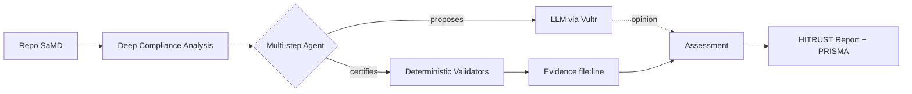
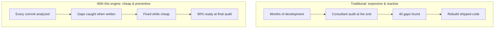

# SaMD HITRUST Compliance Engine

**A HITRUST compliance engine for Software as a Medical Device (SaMD) that analyzes real code and certifies controls with verifiable, deterministic evidence.**

> **Core principle:** AI proposes; deterministic evidence certifies.

---

## The problem

Certifying SaMD against HITRUST is slow and expensive. Most AI-assisted compliance tools hallucinate—they mark controls as satisfied without proof. In healthcare, a false positive means patient data left unprotected.

This engine separates **opinion** from **proof**. The LLM explores the codebase and proposes control status; only deterministic validators can upgrade a control to **certified** with file-and-line evidence you can reproduce.

---

## How it works



1. **Deep compliance analysis** scans the repository and builds a structured inventory of security-relevant code and infrastructure.
2. A **multi-step agent** plans retrieval, queries the repo multiple times, and invokes validators—not a single retrieve-then-answer call.
3. The **LLM proposes** control status (`confidence: proposed`); **deterministic validators certify** with reproducible evidence (`confidence: validated`).
4. Results are ranked by **patient risk score** and rendered as a **HITRUST CSF e1 report** with **PRISMA maturity** levels.

---

## The three ways to use it

### a) On-demand readiness assessment

Point the API at a SaMD repository and receive a full assessment: compliance score, prioritized gaps, and corrective actions. Replaces weeks of manual consultant review with an evidence-backed snapshot you can share with engineering and QA.

### b) CI/CD compliance gate

Integrate the API into your pipeline. Every merge is analyzed; the build fails if the score drops or a critical gap is introduced. Compliance is enforced on every commit—not discovered at the end of a release cycle.

### c) Continuous monitoring

HITRUST certification is valid for two years, but code keeps changing. Run the API on a schedule and track how your score evolves over time—catch regressions before your next formal assessment.



---

## API endpoints

| Method | Endpoint | Description |
|--------|----------|-------------|
| `POST` | `/v1/analyses` | Start an async analysis of a target repository. Returns `analysis_id` and `status: pending` (202). |
| `GET` | `/v1/analyses/{job_id}` | Poll job status (`pending` → `running` → `completed` or `failed`). |
| `GET` | `/v1/analyses/{job_id}/controls` | All controls with status, confidence, evidence, and patient risk score. |
| `GET` | `/v1/analyses/{job_id}/gaps` | Gaps and partial controls, sorted by `patient_risk_score` (highest risk first). |
| `GET` | `/v1/analyses/{job_id}/evidence/{control_id}` | Evidence file for a single control—what an auditor would inspect: LLM proposal vs. validated proof. |
| `GET` | `/v1/analyses/{job_id}/report` | HTML HITRUST assessment report with PRISMA maturity (browser or print-to-PDF). |
| `GET` | `/v1/analyses/{job_id}/summary` | Executive one-liner: validated count, gap count, and top critical gap. |
| `GET` | `/v1/audit-log` | Full API audit trail: who requested what analysis and when. |
| `GET` | `/v1/controls` | Catalog of HITRUST controls in the current e1 subset with framework references. |

Interactive OpenAPI docs: [http://localhost:8000/docs](http://localhost:8000/docs)

---

## Quickstart

### 1. Create a virtual environment and install dependencies

```bash
python -m venv .venv && source .venv/bin/activate
pip install -r requirements.txt
```

### 2. Configure environment variables

```bash
cp .env.example .env
```

Edit `.env` and set your Vultr Serverless Inference credentials:

```env
VULTR_API_KEY=your_key_from_vultr_console
VULTR_BASE_URL=https://api.vultrinference.com/v1
VULTR_MODEL=deepseek-v4-flash
```

List available models:

```bash
curl https://api.vultrinference.com/v1/models \
  -H "Authorization: Bearer $VULTR_API_KEY"
```

### 3. Start the API

```bash
uvicorn main:app --reload
```

### 4. Run an analysis

**With curl:**

```bash
# Start analysis
curl -X POST http://localhost:8000/v1/analyses \
  -H "Content-Type: application/json" \
  -d '{"target":"sample_repo"}'

# Poll until status is "completed"
curl http://localhost:8000/v1/analyses/{analysis_id}

# Fetch gaps (sorted by patient risk)
curl http://localhost:8000/v1/analyses/{analysis_id}/gaps

# Open the HTML report in your browser
open http://localhost:8000/v1/analyses/{analysis_id}/report
```

**With the helper script:**

```bash
chmod +x analizar.sh
./analizar.sh sample_repo
```

The script submits the job, polls until completion, saves controls to `{repo_name}.json`, and prints the report URL.

---

## Tech stack

| Layer | Technology |
|-------|------------|
| API | FastAPI (async) |
| LLM | Vultr Serverless Inference (DeepSeek-V4-Flash) |
| Certification | Deterministic validators (no LLM in the evidence path) |
| Framework | HITRUST CSF e1 subset with PRISMA maturity mapping |

**Project layout:**

| File | Role |
|------|------|
| `main.py` | FastAPI app, report rendering, audit log |
| `agent.py` | Multi-step agent: plan → retrieve → propose → validate → rank |
| `validators.py` | Deterministic control validators (anti-hallucination layer) |
| `analysis.py` | Deep compliance scan and patient risk scoring |
| `sample_repo/` | Example SaMD repo with a deliberate audit-logging gap |

---

## Disclaimer

This tool provides **automated readiness and pre-assessment** only. It does **not** replace a certified HITRUST External Assessor. Results reflect evidence detected in code and infrastructure; official HITRUST certification requires human review by an accredited assessor.
